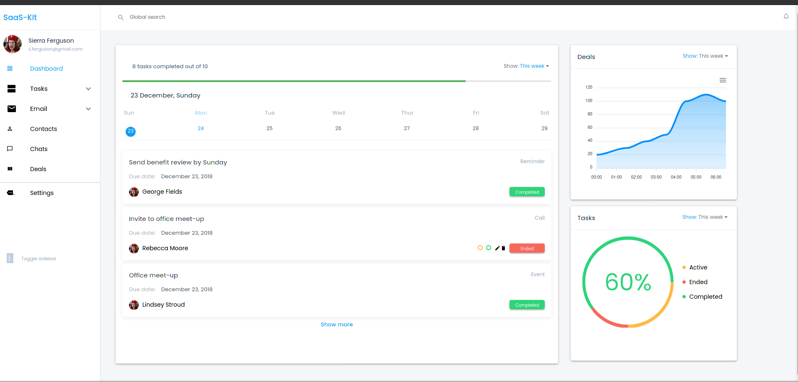
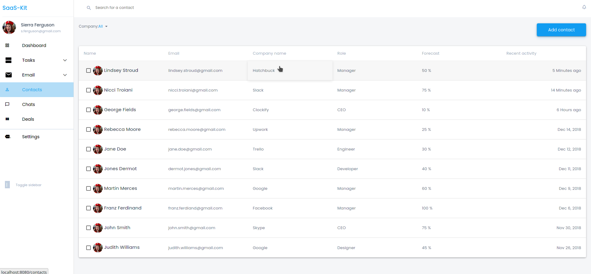
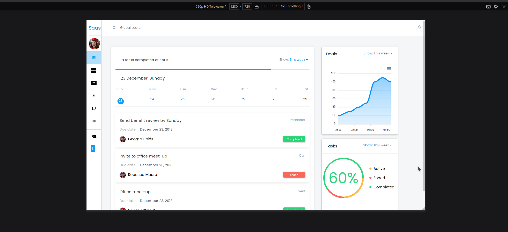

# friendly-chainsaw-sass-kit

[](https://app.netlify.com/sites/friendly-chainsaw-sass-kit/deploys)
[](https://circleci.com/gh/MarvinKweyu/ColorDetect)

**Live site:** https://friendly-chainsaw-sass-kit.netlify.app/ 

**Project board:** https://github.com/MarvinKweyu/friendly-chainsaw-sass-kit/projects/1

**Sample output images**

Dashboard



Contacts


Toggled sidebar

## Project setup
```
npm install
```

### Compiles and hot-reloads for development
```
npm run serve
```

### Compiles and minifies for production
```
npm run build
```

### Run your unit tests
```
npm run test:unit
```

### Lints and fixes files
```
npm run lint
```

### Customize configuration
See [Configuration Reference](https://cli.vuejs.org/config/).
